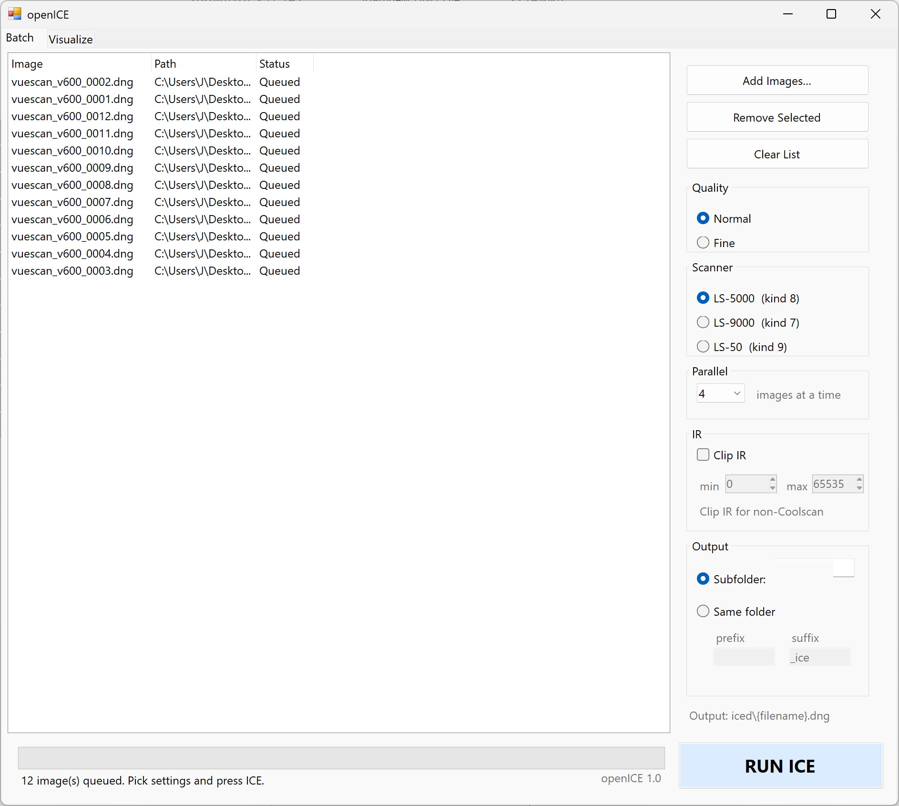
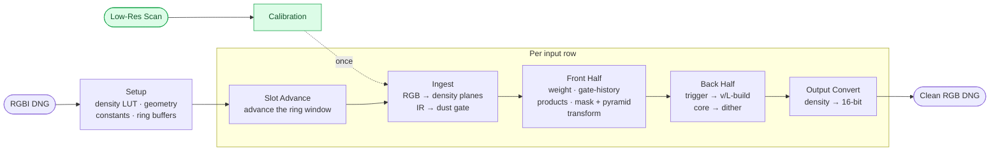

# openICE

An open reimplementation of Applied Science Fiction's **Digital ICE** infrared dust-and-scratch removal in C#. It reads an **RGBI DNG** and writes a **clean RGB DNG**.
Based on the Nikon Coolscan LS-5000/9000 profile in Nikon Scan 4. 

> The original tool is tuned for Coolscan scanners; using other scanners may not show the best results. To use this tool for non-Coolscan scanners, see [Using non-Coolscan Scanners](docs/noncoolscan.md). 

## How to Use - GUI
If you want a quick, simple tool for ICE, download `openice_gui.exe` from the **Releases** tab on the right. 




## How to Use - CLI

Run it from a terminal. This gives a bit more control over ICE.

```
openice.exe <in.dng> [out.dng] [options]
```

| Option | Meaning |
|---|---|
| `-o <out.dng>` | Output path. Defaults to `<in>.openice.dng`; a bare second argument works too. |
| `-order <RGBI>` | Channel order of the source samples (default `RGBI`); the 4th letter marks the IR channel. Set this if your DNG stores the channels in a different order. |
| `-dpi <N>` | Override the source resolution instead of reading it from the DNG. |
| `-lowres <file>` | A low-resolution scan of the same frame, used to calibrate ICE. If omitted, openICE down-samples the main scan instead — visually close, but not bit-exact. |
| `-lowres_fields <V>` | The three calibration values directly, as `irCrosstalk,Rref,irRefRaw` (comma-separated). When given, used instead of a low-res scan. |
| `-fine` | Use ICE **Fine** instead of the default **Normal** (see [parameters](docs/parameters.md)). |
| `-kind <7\|8\|9>` | Scanner reconstruction target: **8** = LS-5000 (default), **7** = LS-9000, **9** = LS-50 (see [parameters](docs/parameters.md)). |

## To Get Started

**Requirements**

- 64-bit Windows with the .NET Framework 4.x runtime (already installed on Windows 10 / 11).
- An **RGBI** scan saved as a DNG — either interleaved (VueScan's "48/64-bit RGBI") or with the infrared in a
  separate plane (SilverFast). Both little- and big-endian DNGs are read and written.
- Modest memory: the pipeline streams row by row, so even a full 24 MP frame stays well under a gigabyte.

Download the latest `openice.exe` from this repo's **Releases** tab.

## Build

### GUI
```powershell
csc /platform:x64 /target:winexe /main:OpenIceGui /out:openice_gui.exe ^
    /r:System.Windows.Forms.dll /r:System.Drawing.dll ^
    src\openice_gui.cs src\openice.cs src\IcePump.cs src\IceSetup.cs src\IceRow.cs src\IceFront.cs ^
    src\IceBack.cs src\IceCore.cs src\IceBuffers.cs src\IceAnalyze.cs src\dng.cs
```

### CLI
```powershell
csc /platform:x64 /optimize+ /out:openice.exe ^
    src\openice.cs src\IcePump.cs src\IceSetup.cs src\IceRow.cs src\IceFront.cs ^
    src\IceBack.cs src\IceCore.cs src\IceBuffers.cs src\IceAnalyze.cs src\dng.cs
```

## Nikon Scan 4 vs openICE

**See [VALIDATION.md](docs/VALIDATION.md).**

| Input | From Nikon Scan | openICE w/ Low-Res | openICE w/o Low-Res |
|:---:|:---:|:---:|:---:|
|  |  |  |  |

## Project Layout

```
src/
  openice.cs     CLI: RGBI DNG in → clean RGB DNG out
  IcePump.cs     the per-row streaming driver
  IceAnalyze.cs  the low-res calibration pass (crosstalk + IR-ref → irCrosstalk, IRref)
  IceSetup.cs    Phase 0: density LUT, geometry, per-scan constants
  IceBuffers.cs  the ring / plane / staging buffers (original buffer allocator, transliterated)
  IceRow.cs      Phase 1: per-row ring slot-advance + frame reset
  IceFront.cs    Phase 2: the 6 front-half builders
  IceBack.cs     Phase 3: reconstruction driver + v/L build + output convert
  IceCore.cs     the soft-threshold reconstruction core + dither/LCG helpers + Sdc state
  dng.cs         DNG read/write (RGBI DNG in, 3-channel RGB DNG out)
src_C/           the byte-exact C port of src. See src_C/README.md
```

## openICE pipeline



See [Pipeline](docs/pipeline.md)

## Why do I need Low-Res Scan for ICE?

Nikon Scan's Digital ICE requires an initial low-res scan to calculate three calibration values. Specifically, they are:

| Values | Meaning |
|---|---|
| `irCrosstalk` | Dye→IR crosstalk: the fraction of the visible (red) signal that bleeds into the IR channel. Subtracted from IR so the dust gate reacts only to dust and scratches, not to the picture. |
| `Rref`        | The **visible** (red) reading of clear film — an IR-weighted average over dust-free areas. The baseline the crosstalk term corrects for. |
| `irRefRaw`    | The **infrared** reading of clear film — the same IR-weighted average. The "no-dust" IR level, before the crosstalk correction. |

However, we found that using a down-sampled image of the main scan still gives visually good performance. By default, openICE uses a down-sampled image as the low-res scan. See [VALIDATION.md](docs/VALIDATION.md).

## TODO
- MacOS support

## License

openICE is free software, licensed under the **GNU General Public License v3.0** — see [LICENSE](LICENSE). You
may use, study, modify, and redistribute it; if you distribute a modified version, it must also be GPL-3.0 and
carry its source.

Copyright (C) 2026 &lt;a6o&gt;