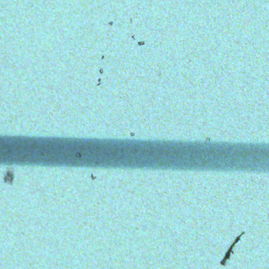
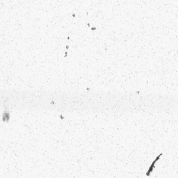
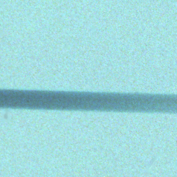
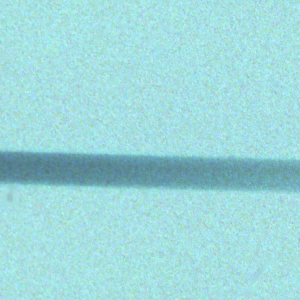
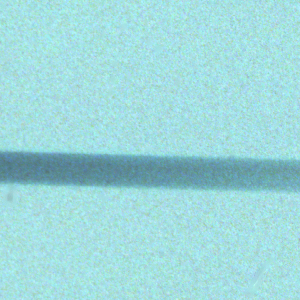
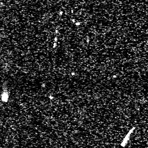
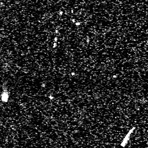

# openICE Validation/Metrics

Here we show visual and quantitative comparisons of openICE vs Nikon Scan's Digital ICE. Overall, they are not byte-exact, but **visually indistinguishable**.

## Speed
On a single Dell XPS 9640 laptop (Intel Core Ultra 7 155H, 32G memory) it takes about 8 seconds to run openICE on a single 35mm image (average of 10 runs on a 3946×5959 frame, end-to-end including DNG read/write), or 29.6 seconds on a 6x9 image (8964x13176).

## Visual Results
### Input Image

| RGB with dust | IR channel |
|:---:|:---:|
|  |  |

| Input | NikonScan | **openICE** w/ Low-Res | **openICE** w/o Low-Res |
|:---:|:---:|:---:|:---:|
|  |  |  |  |

### Edit Intensity
| IR | NikonScan | **openICE** w/ Low-Res | **openICE** w/o Low-Res |
|:---:|:---:|:---:|:---:|
|  |  |  |  |

## Whole-frame Metrics

For fair comparison, we used 19 different film scans, of different film stocks. For accurate comparisons, scans are extracted from NikonScan 4, intercepted at ICE's entry points inside the running Nikon Scan 4.

**Recall**: Among dusts that NikonScan removed, how many did openICE also remove?  
**Precision**: Among dusts that openICE removed, how many did NikonScan also remove?  
**ME**: Mean \|Error\|. What is the difference in pixel values between NikonScan and openICE? Only computed on pixels that openICE modified.  
**RMSE**: Root-mean-square of that same NikonScan−openICE difference, like ME but penalizing large errors more, same pixel set, in 16-bit levels.

| Method | Modified % | Recall ↑ | Precision ↑ | ME ↓ | RMSE ↓ |
|---|---|---|---|---|---|
| NikonScan | 83.5% | - | - | - | - |
| C implementation | 83.5% | 100.0% | 100.0% | 0 | 0 |
| openICE w/ Low-Res | 83.5% | 99.9% | 99.9% | 99 | 351 |
| openICE w/o Low-Res | 82.3% | 97.6% | 99.0% | 272 | 593 |

> _What does it mean that ICE modifies 80\% of images?_ Original ICE is aggressive, often fixing more than half of the whole image, most of it being 1-pixel noise. While these noises are edited, they are minimally edited (<0.05\% change in pixel values).

## Mis-match in Results

> openICE's **C build is byte-exact** with Nikon Scan's ICE — it reproduces the original engine to the last bit (Recall / Precision 100%, ME/RMSE 0 in the table above), across all >20 of ICE's functions. The **C# build is not** byte-exact, for a single reason: C# has no 80-bit floating-point type. That one last-bit gap is then blown up by the shared dither RNG into the small differences you see. It is unavoidable in C#, and not visually distinguishable. 

1. Nikon Scan's 2003 MSVC build runs its float math on the **x87 FPU** (80-bit intermediates, rounded only on store), where C# rounds every operation to IEEE 32/64-bit. The C build recreates the 80-bit path with `long double` and matches exactly — C# has no 80-bit type, so it can't. 
2. That gap sits in the whole reconstruction accumulator (base + detail bands), which C# keeps in `double`. With the dither off it's all that's left: ~0.2% of pixels, off by a few 16-bit levels.
3. ICE dithers every reconstructed pixel from one shared RNG, and how many times it's drawn hinges on those last-bit-different values; one disagreement desyncs the RNG, so every later pixel gets a **different but zero-mean grain**. That's where most non-exact pixels come from: same picture underneath, different grain.
4. ICE carries global state *across* a batch scan, so a frame isn't independent. A frame-by-frame tool resets that state, so it can only reproduce a frame that was first (or alone) in its scan.

So the C build is byte-exact and C# isn't — but the C# gap is smaller than the scanner's own repeatability: scan the same film twice and the pixels won't match either, though both look identical. 