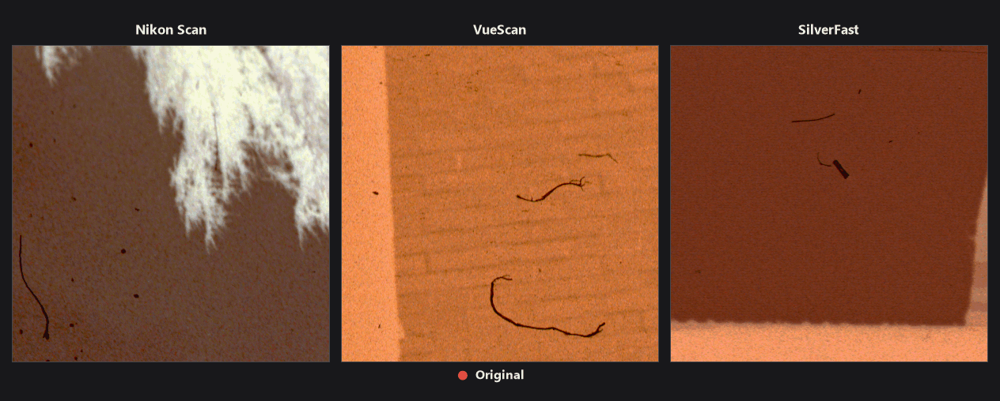
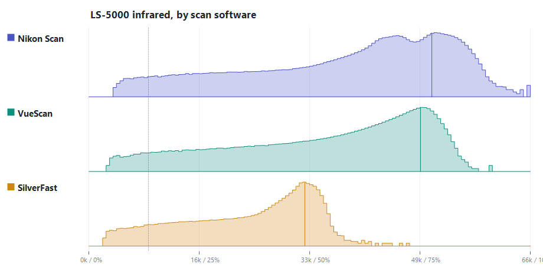
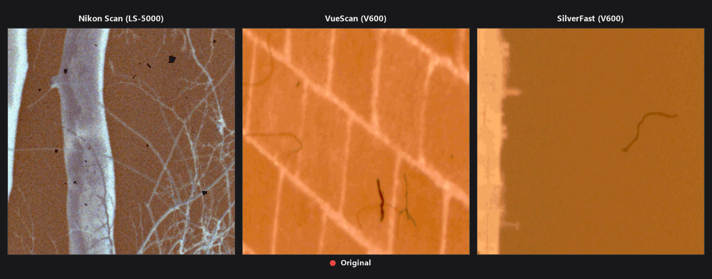
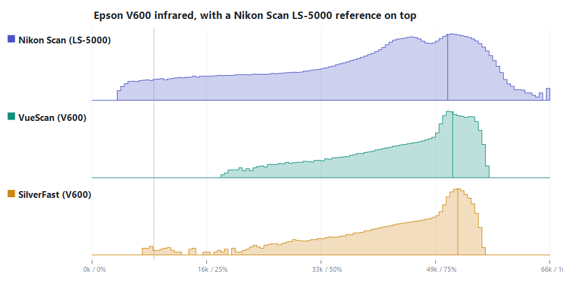
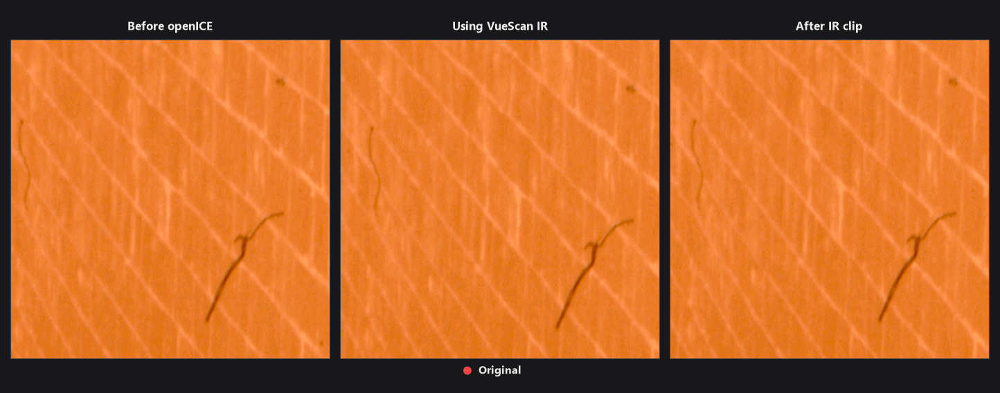
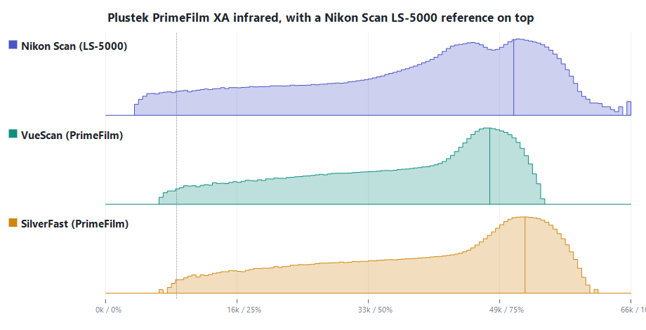
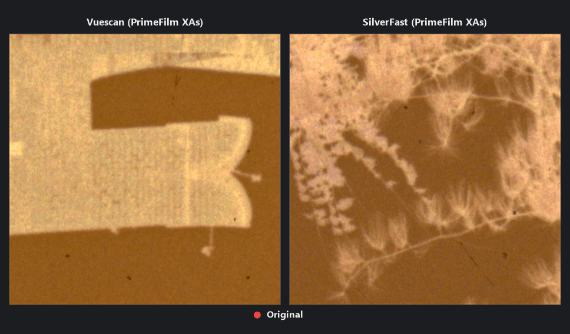

# Using Non-Coolscan Scanners

Because ICE here is designed to work best with Coolscan Scanners scanned with Nikon Scan, using other scanners or scanner programs may give imperfect results, specifically with thick dust or hair. 

## Using Different Scanner Software for Coolscan 5000

*Using openICE with RGBI scan from different software*

While it is not clear how other software saves IR-values, when we look at the histogram of IR-values, they look very different from Nikon Scan's IR values. 

Because ICE has internal calibration, ICE works pretty robustly with different scanner software. However, if the graph is too bright or too dark, we expect ICE will not work well.

## Using Epson V600

*Unlike with the LS-5000, you see some residue in both scans of the Epson V600 when openICE is applied*

V600 has an issue: its IR pixel values are a lot narrower. The dark part (where dust is located) is too bright, and the bright part (no dust) is too dark. This leads to the failure of openICE.
One possible fix is to clip the IR values and make the contrast higher. You can use `visualize` in the openICE GUI tool to find the best setting for IR clipping and set that in `batch`. 

## Using Primefilm XAs

