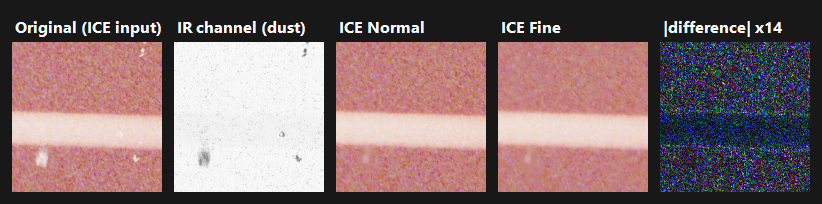

# Parameters

## Kind (7/8/9)

Nikon Scan's ICE engine takes a `kind` argument. We assume this is an argument for the scanner type. I was able to check LS-9000 and LS-5000, but not LS-50. 

| Scanner | Kind |
| --- | --- |
|LS-9000 | 7 |
| LS-5000| 8 |
| LS-50* | 9 |

*Assumption

### What it changes

| Reconstruction field | Kind 8 (LS-5000) | Kind 7 (LS-9000) |
|---|---|---|
| Per-channel reconstruction coefficients (3 × 7 block) | LS-5000 set | LS-9000 set |
| IR-gate bias | **1.0** | **0** (gate runs 1.0 higher) |
| Dither density band | **0.01 – 0.99** | **0.04 – 0.96** (narrower) |
| Band lookahead window | **1600** rows | **950** rows |

#### Reconstruction coefficients

The coefficients turn the IR channel's defect map into the brightness added back to R, G and B. Nikon measured a
different set per scanner.

#### IR-gate bias

The IR "clear-film" gate is formed as `(d_IR − ct·d_R)/(1 − ct) − bias`. Kind 8 subtracts **1.0**; kind 7
subtracts **0**, so its gate sits exactly 1.0 higher. Kind 7 is more conservative about which pixels it treats as defect versus clean film.

#### Dither density band

ICE sprays a tiny zero-mean dither onto reconstructed pixels, but only for pixels whose density falls inside a
band (as a fraction of full scale). Kind 7's band is narrower so pixels
very near clear or very near maximum density are left un-dithered.

#### Band lookahead window

The engine cleans the scan row by row instead of loading the whole image, so it keeps a buffer of upcoming rows
in memory as it works. This setting is just how big that buffer is: **1600** rows for the LS-5000, **950** for
the LS-9000.


## ICE quality: Normal / Fine (`-fine`)

Nikon Scan offers Digital ICE at two quality levels, **Normal** and **Fine**. openICE runs Normal by default;
pass `-fine` for Fine:

```
openice in.dng -o out.dng            # ICE Normal (default)
openice in.dng -o out.dng -fine      # ICE Fine
```

The manual says:

| Setting | Description |
|---|---|
| Normal | The image is processed digitally to remove the effects of scratches and dust. |
| Fine | Use this setting to remove very thin scratches or dust that is barely visible. Note that the overall sharpness of the image may be reduced. |


### What it changes


| Reconstruction field | Normal | Fine |
|---|---|---|
| Detail-band stage gains (×3) | 1.25 | 1.0 |
| L3 output clamp | on | off |

#### Detail-band stage gains

Each detail band (the fine-scale detail recovered at each pyramid level) is multiplied by a stage gain before it's
added back: Normal boosts it (**1.25**), Fine adds it at face value (**1.0**). So Fine comes out slightly softer —
the "sharpness may be reduced" the manual warns about.

#### L3 output clamp

After reconstructing a pixel, ICE compares it to the raw scan (**L3**). Normal keeps the *brighter* of the two, so
it fills only pixels a defect darkened and leaves clean areas untouched; Fine drops the clamp and always writes the
reconstruction, rewriting the **whole frame**, not just defects. It
isn't a better *detector* though: the give-up gate is identical in both; Fine just applies the fix everywhere.

### Example

 
