# The Digital ICE Algorithm

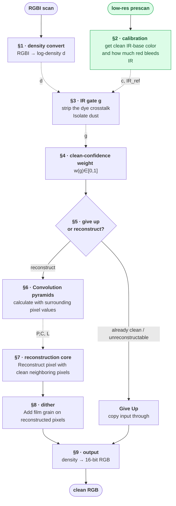

This document explains the algorithm of Digital ICE. While the description mainly follows the kind 8 profile of a Nikon Coolscan LS‑5000, the LS‑9000 and LS‑50 targets run the same algorithm with different profile constants, summarised at the end of Appendix B.

To help you read through the doc, I've added two things:

> A quote block gives you a rough high-level idea of each section

and a blue-colored symbol like $\textcolor{blue}{\alpha}$ means it's some specific constant value hard-coded in Digital ICE. The exact value can be found in the Appendix. 

## 0. The premise: infrared sees only dust

A scanner that captures a 4th, infrared channel alongside R, G, B gets a **map of the physical
defects** that is almost independent of the picture content. (The exception is R, which bleeds into the IR channel.) Wherever the IR channel is dark, light was lost to a
defect, and *the same amount of light was lost from R, G, B at that spot.* Digital ICE uses the IR channel to

1. locate defects,
2. estimate how much light each defect stole from the visible channels, and
3. rebuild the visible color there from the target and surrounding intact pixels, guided by the IR map.

Everything below is the machinery that does (1)–(3) robustly.

## 1. Working domain: logarithmic density

> Instead of working with raw values, we convert them to logarithmic density. 

All processing happens in a **log‑density** domain, not on raw linear samples. Define, for a 16‑bit sample
$v \in [0, 65535]$ and $M = 65535$,

$$
D(v)  =  \frac{M}{16\ln 2}\ln(v+1)  =  \frac{M}{16}\log_2(v+1).
$$

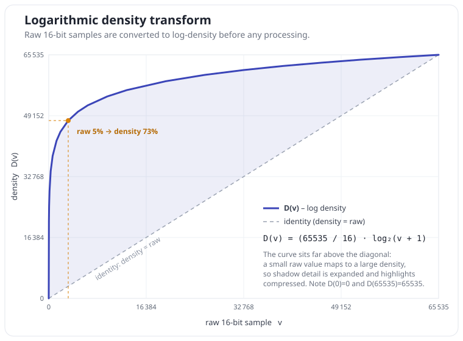

$D$ is monotonic on $[0,M]$, with $D(0)=0$ and $D(M)=M$. Because it is a logarithm, a defect that blocks a fixed
fraction of the light becomes a fixed subtraction in density rather than a scaling.

$$
D^{-1}(d)  =  \mathrm{round}\big(e^{d\cdot16\ln 2 / M} - 1\big), \qquad \text{clamped to } [0, M].
$$

Notation used throughout: $d_R, d_G, d_B, d_{IR}$ are the density‑converted channels of a pixel.

## 2. Calibration (once, from a low‑resolution prescan)

> Find the IR density of clean film _without the effect of the red dye_ ($IR_\text{ref}$), and also how much the red dye affects the IR channel ($c$)

The main goal of this task is to find the value of the transparent IR layer, $IR_\text{ref}$. However, since red dye bleeds into the IR sensor, calculating from the IR layer alone only gives you $IR_\text{raw}$ (a mix of IR and red bleed).

To do this, ICE runs a quick analysis over a **low‑resolution scan of the same frame** to measure three numbers that describe *this frame's clear film*.
These are then held **constant** for the entire main pass.
Let a pixel be **clear‑film** if its raw IR value exceeds a fixed gate $\textcolor{blue}{\tau} = 8847.23$ (this seems to be a _magic number_). Over the prescan:

**Two reference levels** (IR²‑weighted means over *all* clear‑film pixels):

Now we need a reference value for clear film. One way is to take the average value of all the pixels above $\textcolor{blue}{\tau}$. But here, we use inverse‑variance weighting, which in this case is the same as an IR²‑weighted mean. (Weighting by
$IR^2$ leans the average toward the clearest pixels.)
$$
R_\text{ref}  =  \frac{\sum IR^2 d_R}{\sum IR^2}, \qquad\qquad
IR_\text{raw}  =  \frac{\sum IR^2 d_{IR}}{\sum IR^2}.
$$

Thus,
$R_\text{ref}$ is the average red density of clear film; $IR_\text{raw}$ is its average IR density.
Notation can be a bit confusing here. $IR$ is a raw value, but $d_R$, $d_{IR}$, $R_\text{ref}$, and $IR_\text{raw}$ are in logarithmic density space.

**The dye→IR crosstalk.** The goal is to find $c$ = how much the red dye leaks into the IR channel. The idea is that if red dye leaks, that part of the film is denser (darker) in the IR channel too. So for parts of the image where the red is dense, the IR also gets a little denser; and the denser the red, the denser the IR.

To measure that leak, ICE looks only at the **8×8 tiles that are entirely clear film** (all 64
pixels above $\textcolor{blue}{\tau}$), so any variation must be dye, not dust. It splits each such tile into four 4×4
quadrants, and for each quadrant $q$ we calculate the following:

$\delta^{IR}_q$ = `(quadrant q's IR mean)   − (whole‑tile IR mean)`  
$\delta^{R}_q$ = `(quadrant q's red mean)  − (whole‑tile red mean)`

Then, for each quadrant $q$, we get the slope

$$\frac{\delta^{IR}_q}{\delta^{R}_q}$$

The main idea is that if we average all these slopes, we get the value $c$. 
Now, if we plot all the $\frac{\delta^{IR}_q}{\delta^{R}_q}$ on a plane, it looks like the following:

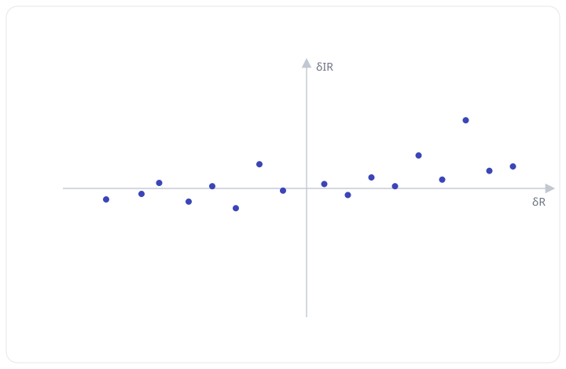

However, there may be obvious outliers that you do not want to include. ICE only keeps values that are within plausible slopes (ratio in $[-0.2, 0.2]$; this is another hard-coded magic number).

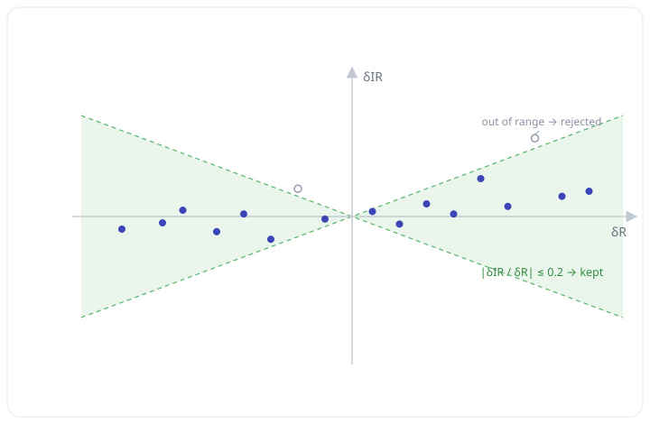

Now we want to fit a line — specifically, a least-squares slope. Thus, we use the following equation:

$$
c  =  \frac{\sum_q \big(\delta^{IR}_q/\delta^R_q\big) w_q}{\sum_q w_q},
\qquad
w_q  =  \big(\delta^R_q\big)^2\Big(\textstyle\sum_{\text{tile}} IR\Big)^2 \ \ [\text{only if the ratio is in range}].
$$

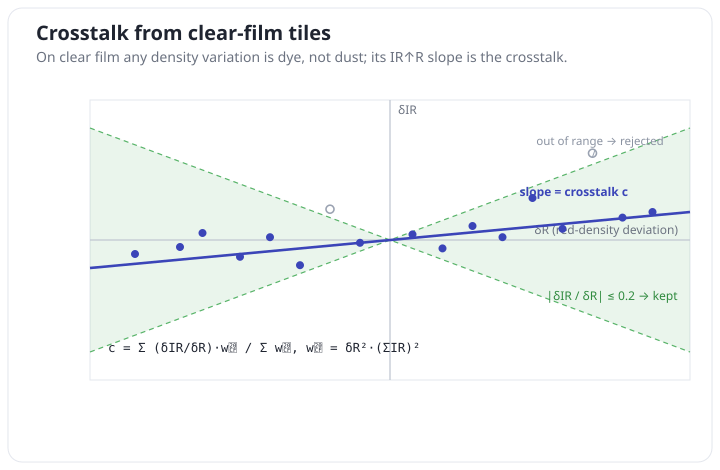 

**The clear‑film IR reference**:

Now that we have found $c$, we can calculate $IR_\text{ref}$. 

$$
IR_\text{raw} = (1-c)IR_\text{ref}+cR_\text{ref}\\
\boxed{IR_\text{ref}  =  \frac{IR_\text{raw} - cR_\text{ref}}{1 - c}
}
$$

The main pass uses just two of these downstream: the crosstalk $c$ and the reference $IR_\text{ref}$, the clear-film IR value without the red dye.

## 3. The IR gate: isolating the defect signal

> From the IR measurement, remove the effect of the red dye. We call this value the gate ($g$): for a clean image $g=IR_\text{ref}$, and when there is a defect, it will be smaller.

First remove the dye crosstalk measured in §2 from the IR density, so the remaining signal responds to
**defects only**, not to the picture (see [Appendix C](#appendix-c-why-crosstalk-removal-is-a-subtraction-the-log-density-trick)):

$$
g  =  \frac{d_{IR} - cd_R}{1 - c}  -  \textcolor{blue}{\theta} ,
$$

where $\textcolor{blue}{\theta}$ is the **gate bias**, a fixed per‑profile constant (see [Appendix B](#appendix-b--constants)).

<details style="background:rgba(128,128,128,0.08);border:1px solid rgba(128,128,128,0.3);border-radius:8px;padding:6px 14px;margin:10px 0;">
<summary style="cursor:pointer;font-weight:600;padding:4px 0;">Derivation</summary>

The density of each channel can be seen as a sum of film base, dye, and defect. In other words,

$$
d_R  =  B_R + r - \delta, \qquad\qquad d_{IR}  =  B_{IR} + cr - \delta,
$$

where $B_R$ and $B_{IR}$ are the film base in the red and IR channels, respectively, and $\delta$ is the defect. It is important to note that $\delta$ is neutral, which means that it removes the same amount of density from every channel.

We subtract $cd_R$ from $d_{IR}$ to
kill the dye from the above equations:

$$
d_{IR} - cd_R  =  (B_{IR} - cB_R) + \underbrace{(cr - cr)}_{\text{dye cancels}} + \underbrace{(-\delta + c\delta)}_{-(1-c)\delta} = (B_{IR} - cB_R) - (1-c)\delta .
$$

Thus, 

$$
\frac{d_{IR} - cd_R}{1 - c}  =  \underbrace{\frac{B_{IR} - cB_R}{1-c}}_{= IR_\text{ref}}  -  \delta .
$$

Subtracting the gate
bias $\textcolor{blue}{\theta}$ gives

$$
g  =  \frac{d_{IR} - cd_R}{1 - c} - \textcolor{blue}{\theta}  =  IR_\text{ref} - \delta - \textcolor{blue}{\theta} .
$$

So $g$ sits at $IR_\text{ref}-\textcolor{blue}{\theta}$ on clear film ($\delta = 0$) and drops by exactly the stolen light $\delta$ where a
defect blocks IR.

</details>

$g$ is high on clear film (IR passes) and drops wherever a defect blocks IR. It is the single scalar "how
intact is this pixel" signal that drives everything downstream. 

## 4. The clean‑confidence weight

> $g$ is a bit hard to use, so we convert it into a "cleanness score", where a value of $1$ means the pixel is perfectly clean, $0$ means it is completely dirty, and anything in between is mildly dirty.

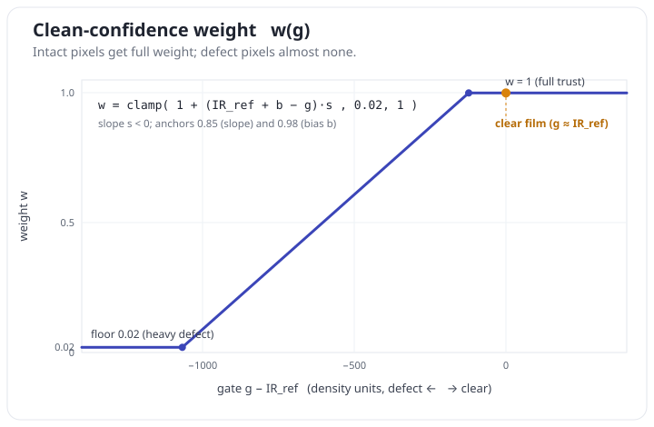

From §3, we've isolated the IR pixel value into a signal that only responds to the defect (the gate). Now we want to turn the gate into a weight whose value lies in $[\textcolor{blue}{w_\text{floor}}, 1]$. ($\textcolor{blue}{w_\text{floor}}=0.02$. See [Appendix B](#appendix-b--constants))

$$
w(g)  =  \mathrm{clamp}\Big(1 + \big(IR_\text{ref} + b - g\big)s,\ \ \textcolor{blue}{w_\text{floor}},\ \ 1\Big),
$$

where
$$
s = \frac{1}{D(\lfloor 0.85M\rfloor) - M}, \qquad b = D(\lfloor 0.98M\rfloor) - M, \qquad \textcolor{blue}{w_\text{floor}}=0.02.
$$

So when the weight is 1, the pixel contains no dust; when it is 0.02, the pixel is covered by dust.

<details style="background:rgba(128,128,128,0.08);border:1px solid rgba(128,128,128,0.3);border-radius:8px;padding:6px 14px;margin:10px 0;">
<summary style="cursor:pointer;font-weight:600;padding:4px 0;">Explanation of the Equation</summary>

To start, $w$ is just a **straight line in $g$, clamped to $[\textcolor{blue}{w_\text{floor}}, 1]$**.
$$
w(g)  =  1 + (IR_\text{ref} + b - g)s
$$

Since $s < 0$, the slope $-s$ is positive: **a brighter (cleaner) gate gives a higher weight.**

Now, let's go one-by-one and try to figure out what this equation means. 

- $IR_\text{ref} + b$:

This is the gate level of clean film. Recall that the gate is $g=IR_\text{ref} - \delta - \textcolor{blue}{\theta}=IR_\text{ref} - \text{defect} - \text{bias}$. Ignoring the bias, clean film should have gate $IR_\text{ref}$. However, instead of requiring exactly $IR_\text{ref}$, we allow a little margin $b<0$, and we say that if the gate is above $IR_\text{ref} + b$, the film is clean.

- $b$:

$b = D(\lfloor 0.98M\rfloor) - M$. $M$ was previously defined to be the maximum value of 16-bit (65535). So $b$ is just the density difference between 98% and 100% brightness. In this case, it is $-119$.

- $IR_\text{ref} + b - g$:

This shows how dirty the pixel is. If this value is below 0, it means it's clean. If it's positive, it means there is dust. 

- $\times s$

Similarly, 
$M - D(\lfloor 0.85M\rfloor) = 960.42 ...$ density units, which means that if the gate $g$ is lower than our clean-film threshold of $IR_\text{ref} + b$ by 960.42 density units, then $(IR_\text{ref} + b - g)s\leq-1$, and thus $w(g) \leq 0$.

- Overall:

$$
w(g)  =  1 + (IR_\text{ref} + b - g)s
$$

When there is no dust, $w(g) \geq 1$. When there is maximum dust, $w(g) \leq 0$. 
</details>

**One detail on $g$**:  
Whenever the scan is above $550$ dpi, $w(g)$ is actually $w(\min\big(g_{c-1},\ g_{c},\ g_{c+1}\big))$. The gate that enters $w$ is not the pixel's own, but the **minimum over the pixel and
its two horizontal neighbours**. It is not clear why this is done horizontally only and not vertically, which makes it asymmetric.  

## 5. The per-pixel decision: give up, or reconstruct

> Decide whether we want to clean the pixel or not. We skip cleaning if the pixel is already clean, or if there are not enough clean pixels in the surroundings to make a good reconstruction.

Not every pixel is reconstructed. A pixel is **given up** (its input copied through unchanged) when either:

- **Clean pixel:** If the pixel's own weight is at its ceiling, $w \ge 1$, there is no defect to
  fix.
- **No information in the surroundings:** This test reads the raw IR gate $g$ (§3) directly. ICE takes
  four 9‑sample windows of $g$ around the pixel and, in each, counts how many samples fall below the **dust floor**
  $\textcolor{blue}{\varphi} = D(\lfloor 0.065M\rfloor)$. If at least one of the four windows is entirely below $\textcolor{blue}{\varphi}$, the surrounding pixels are too dark to trust. The defect is too large, so leave the pixel as scanned.

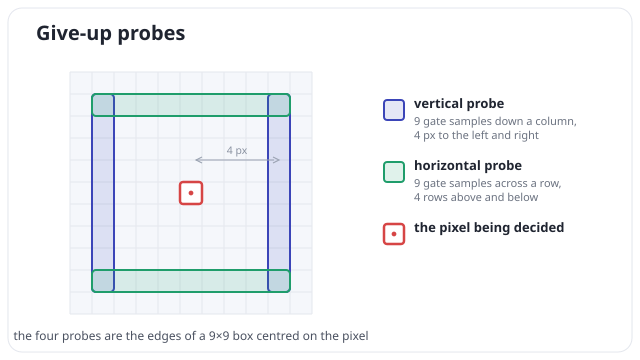

In every other case there is some defect present, but enough intact evidence nearby. These pixels are reconstructed by the reconstruction core (§7).

## 6. Two normalized‑convolution pyramids

> Use convolution to get information about the surrounding pixels, up to $9\times 9$ in size. 

When reconstructing images that are occluded by dust, we need to look at the surrounding pixels to fill in the hole. Each pixel sees at most a $9\times 9$ window around it. But instead of going through all $81$ pixels for every pixel, it calculates a _normalized convolution_. Put simply, a normalized convolution is a "smart" average of the neighbouring pixels. 

<details style="background:rgba(128,128,128,0.08);border:1px solid rgba(128,128,128,0.3);border-radius:8px;padding:6px 14px;margin:10px 0;">
<summary style="cursor:pointer;font-weight:600;padding:4px 0;">Definition: normalized convolution</summary>
A local weighted average in which every input sample carries its own
reliability. Three parts:

- **Image**: $x \in \mathbb{R}^{W\times H}$, where $W$ and $H$ are the width and height of the image, and $x_{u,v}$ denotes the pixel at column $u$, row $v$.
- **Weight**: $w \in \mathbb{R}^{W\times H}$, $w \ge 0$: a *confidence* $w_{u,v}$ for each pixel.
- **Kernel**: $k \in \mathbb{R}^{N_k \times N_k}$, where $N_k$ is the size of the kernel.

$$
\text{output}_{u,v}  =  \frac{\sum_{i,j} k_{i,j}w_{u+i,v+j}x_{u+i,v+j}}{\sum_{i,j} k_{i,j}w_{u+i,v+j}}
$$

$$
\text{confidence}_{u,v}  =  \sum_{i,j} k_{i,j}w_{u+i,v+j}
$$

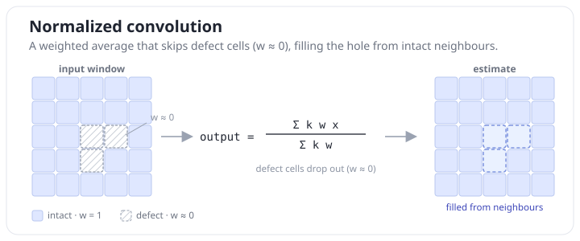

> For simplicity, the convolution equation can also be written as follows:
> $\text{output}_{i}  =  \frac{\sum_{i} k_iw_ix_i}{\sum_i k_iw_i}$
</details>

To get the _values of the neighbouring pixels_, a normalized convolution can be used — specifically, at 4 different scales: $1\times 1$, $3\times 3$, $5\times 5$ and $9\times 9$. The kernel values are as follows:


**The gate pyramid $P_\ell$ and confidence pyramid $C_\ell$.**  

Note $\sum_i k_i=1$
$$

C_\ell  =  \frac{\sum_i k_iw_i}{\sum_i k_i}=\sum_i k_iw_i \qquad\qquad P_\ell  =  \frac{\sum_i k_iw_ig_i}{\sum_i k_iw_i}=\frac{\sum_i k_iw_ig_i}{C_\ell}.
$$

$C_\ell\in [0,1]$ is the **confidence**: the mean IR weight over the scale-$\ell$ neighbourhood. $0$ means the
window is all defect; $1$ means it is all clean film. But the confidence also shows how trustworthy the other values are. If the confidence is low, it means that $P_\ell$ and $L_\ell$ were generated from a small number of clean pixels. If it is high, it means that many clean pixels went into those values. 

$P_\ell$ is the **gate**: the confidence-weighted average of the IR gate $g$.

**The color L‑pyramid**  
$L_\ell$ applies the *same* normalized convolution to each visible channel, using the
weighted products $wd_{\{R,G,B\}}$ vertically summed and horizontally smoothed, normalized by the confidence:

$$
L_\ell  =  \frac{\sum kwd}{\sum kw}=\frac{\sum kwd}{C_\ell}\quad (\ell = 0,1,2),\qquad L_3 = d_{\{R,G,B\}}\ \text{(the raw pixel density).}
$$

So $L_3$ is the original color, while $L_2, L_1, L_0$ are progressively larger, blurrier versions of it.
 

## 7. The reconstruction core

> We start from the most blurred image (convolved from a $9\times 9$ window), and add details back only if they do not come from the defect. 

For a reconstructed pixel, build each output channel's density from the pyramid. This is done per channel $ch\in\{R,G,B\}$. The remaining steps are as follows:

```
#acc_ch = accumulator of the channel
acc_ch  =  L₀ + γ(IR_ref − P₀)        ← §7(a): start at the base color 
                                               + brightness comp
acc_ch += r⁽¹⁾·C'₁ + r⁽²⁾·C'₂ + r⁽³⁾·C'₃   ← §7(b): add back details
acc_ch += dither                       ← §8(a):   add the dither
acc_ch  = max(L₃, acc_ch)              ← §8(b): "only fill, never darken" clamp
output   = D⁻¹(acc_ch)                 ← §9:  convert the finished total 
                                               back to 16-bit
```

**(a) Base color + IR‑guided brightness compensation.**  
Start from $L_0$, the output of the $9\times 9$-sized kernel. Calculate how much light is lost in that $9\times 9$ window, and add the brightness back:

$$
\text{acc}_{ch}  =  L_{0,ch}  +  \textcolor{blue}{\gamma}_{ch}\big(IR_\text{ref} - P_0\big)
$$

$P_0$ is the coarse gate pyramid at the pixel; $(IR_\text{ref}-P_0)$ is the local IR deficit; $\textcolor{blue}{\gamma}_{ch}$ is a
per‑channel profile gain. This is the step that actually **adds back the missing light**. However, since this comes from a convolution of a $9\times 9$ window, the resulting image will be blurred, so we need to add "details". 

**(b) Detail bands with an IR‑gated soft threshold.**

$$
\text{detail}^{(\ell)}_{ch}  =  \big(L_{\ell,ch} - L_{\ell-1,ch}\big) \textcolor{blue}{g_\ell},\qquad \ell = 1,2, 3
$$
Each $\text{detail}^{(\ell)}$ is the **fine structure at scale
$\ell$**. It is the sharpness that the blurrier $L_{\ell-1}$ dropped but the finer $L_{\ell}$ kept: edges, texture, and grain. It is one
band of a Laplacian pyramid, and it is multiplied by $1.25$ to boost the detail. 

Reconstruction starts from the smooth base $L_0$ (§7a) and adds these detail bands
back to restore the sharpness. But we can't simply add them all, because **dust is
also fine, high‑contrast structure**. We need to use the IR values to add back only the detail that belongs to the real image. 

> The high-level idea is to measure the local contrast of the IR values. Only add RGB detail if the detail is larger than the IR contrast. (If the IR contrast is higher, it means that the RGB detail would be coming from the dust, not the film dye.)

For layer $\ell$, let $[\beta_{\text{lo},\ell}, \beta_{\text{hi},\ell}]$ be the local min/max of the scale‑$\ell$ gate‑pyramid detail
$P_{\ell}-P_{\ell-1}$ over a small 5‑point cross (center, its left/right, and the rows above/below). This is the local IR contrast at that scale. 

\* Only above the IR contrast dpi threshold (see Appendix E).

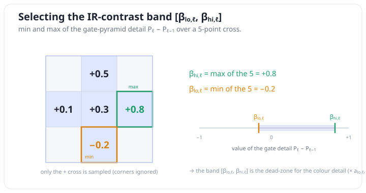

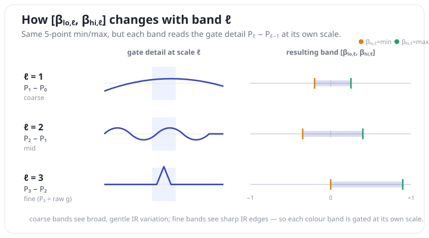

> Using $[\beta_{\text{lo},\ell}, \beta_{\text{hi},\ell}]$, RGB detail is set to $0$ if a defect is expected, or reduced relative to $\beta$.

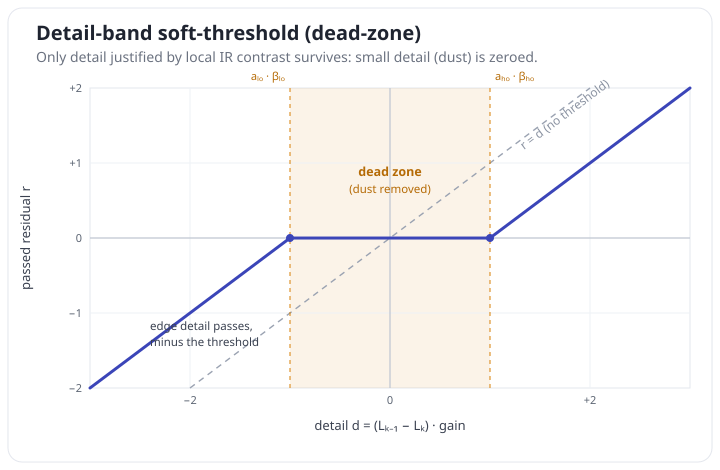

$$
r =
\begin{cases}
\text{detail} - \textcolor{blue}{a}_{\text{lo},\ell}\beta_{\text{lo},\ell}, & \text{detail} < \textcolor{blue}{a}_{\text{lo},\ell}\beta_{\text{lo},\ell} \le \textcolor{blue}{a}_{\text{hi},\ell}\beta_{\text{hi},\ell},\\[2pt]
0, & \textcolor{blue}{a}_{\text{lo},\ell}\beta_{\text{lo},\ell} \le \text{detail} \le \textcolor{blue}{a}_{\text{hi},\ell}\beta_{\text{hi},\ell},\\[2pt]
\text{detail} - \textcolor{blue}{a}_{\text{hi},\ell}\beta_{\text{hi},\ell}, & \text{detail} > \textcolor{blue}{a}_{\text{hi},\ell}\beta_{\text{hi},\ell},
\end{cases}
\qquad
\text{acc}_{ch} \mathrel{+}= r\cdot C'_\ell .
$$

\* When the band is entirely negative ($\beta_{\text{hi},\ell} < 0$), $\textcolor{blue}{a}_{\text{lo},\ell}$ and $\textcolor{blue}{a}_{\text{hi},\ell}$ swap, so the larger coefficient always scales the edge further from zero.

This part is a bit complicated, so bear with me. $\beta$ is the local IR contrast. If $[\beta_{\text{lo},\ell},\beta_{\text{hi},\ell}]$ is wide, it means that there is dust. If it is narrow, it means that the IR is flat, so there is no dust. 
$\textcolor{blue}{a}_{\ \cdot,\ell}$ is a conversion factor that was specifically designed for CoolScan scanners, so we can ignore it.

Now, if the detail (from a color channel) varies as much as the IR does, that color detail is probably dust detail, so we set $r$ to 0. But if the detail is stronger than the IR contrast, this color detail must be coming from the image, not from a defect. 

That is why the dead zone exists in the graph above. But we do not add these details directly: we multiply them by the confidence of band $\ell$, which is $C'_\ell$. 

$C'_\ell$ is computed from the pyramid confidence $C_\ell$ per band:

$$
C'_\ell  = 
\begin{cases}
\min(2C_1,\ 1), & \ell = 1 \quad(\text{doubled, clamped to } [0,1]),\\[3pt]
C_2, & \ell = 2 \quad(\text{used directly}),\\[3pt]
C_3^{2}, & \ell = 3 \quad(\text{squared}).
\end{cases}
$$

So the coarse band ($\ell = 1$) reaches full trust at only half confidence, while the fine band ($\ell = 3$)
contributes only when $C_3$ is near $1$.

<details style="background:rgba(128,128,128,0.08);border:1px solid rgba(128,128,128,0.3);border-radius:8px;padding:6px 14px;margin:10px 0;">
<summary style="cursor:pointer;font-weight:600;padding:4px 0;">Difference between Soft-threshold and C'</summary>

Both suppress dust, but they answer **different questions**.

- The **soft‑threshold** ($r$) asks *"does this detail look like dust?"* It compares the color detail against the
local IR contrast $[\beta_{\text{lo},\ell}, \beta_{\text{hi},\ell}]$. A **content** test, per pixel.
- The **confidence** ($C'_\ell$) asks *"was this detail computed from enough clean film to trust?"* It is the
  mean IR weight over the neighbourhood — how much intact evidence backed the estimate. A **reliability** test.

In short: **the soft‑threshold removes detail that *looks* like dust; the confidence removes detail you
*can't trust*, because it was reconstructed from too little clean film.**

</details>

## 8. Dither

> Add artificial film grain to the reconstructed pixels.

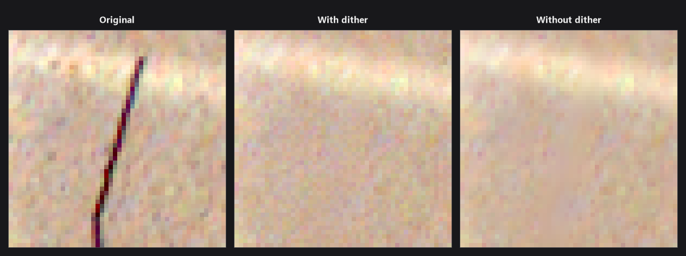

At this point, reconstructed regions are visibly smoother than the surrounding film grain. ICE adds a
**zero‑mean grain**, whose expected amplitude is highest in the mid-tones and close to $0$ in the low and high tones.

$$
\text{dither} =
\underbrace{\frac{4}{(\textcolor{blue}{\eta}_\text{hi}-\textcolor{blue}{\eta}_\text{lo})^2}(x-\textcolor{blue}{\eta}_\text{lo})(\textcolor{blue}{\eta}_\text{hi}-x)}_{\text{parabolic envelope, }0\text{ at band edges}}
 \cdot  \underbrace{\big(u - \tfrac12\big)}_{\in[-\frac12,\frac12)}  \cdot  \textcolor{blue}{\alpha}_{ch}x ,
$$

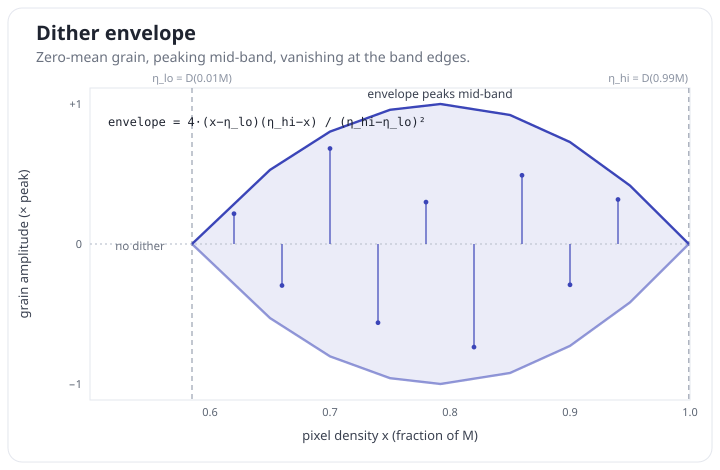

Dither is applied only when $x$ lies inside the density band $[\textcolor{blue}{\eta}_\text{lo}, \textcolor{blue}{\eta}_\text{hi}]$ **and** $x+\text{dither}$ stays inside it (otherwise the grain is
zero). $u$ is a uniform random draw from $[0,1]$.

<details style="background:rgba(128,128,128,0.08);border:1px solid rgba(128,128,128,0.3);border-radius:8px;padding:6px 14px;margin:10px 0;">
<summary style="cursor:pointer;font-weight:600;padding:4px 0;">How the pseudo-random draw u is generated (LCG) in Digital ICE</summary>

The randomness comes from a single **linear congruential generator** shared across the whole frame, advanced
once per draw and never reseeded from a fixed start:

$$
\text{state} \leftarrow (\text{state}\cdot 125 + 1) \bmod 2^{24}, \qquad u = (\text{state}+1)\cdot 2^{-24}.
$$

</details>

**(b) The "only fill, never darken" clamp.**
> Because a defect makes pixels darker, if the reconstruction results in a "darker" pixel, we keep the original pixel.  

Reconstruct only if all three channel accumulators came out
positive (a sanity guard; otherwise give up). Then each output is the **brighter, in density, of the raw pixel
and the reconstruction** (with dither, §8):

$$
\text{out}_{ch}  =  \max\big(L_{3,ch}\ ,\ \ \text{acc}_{ch} + \text{dither}_{ch}\big).
$$

<details style="background:rgba(128,128,128,0.08);border:1px solid rgba(128,128,128,0.3);border-radius:8px;padding:6px 14px;margin:10px 0;">
<summary style="cursor:pointer;font-weight:600;padding:4px 0;">Potential bug</summary>

The formula above is what the clamp *means* to do. What the engine actually does is draw the dither **twice**:
once to decide the comparison, and again to produce the value it stores:

$$
\text{out}_{ch}  = 
\begin{cases}
\text{acc}_{ch} + \text{dither}_2, & L_{3,ch} < \text{acc}_{ch} + \text{dither}_1,\\[2pt]
L_{3,ch}, & \text{otherwise},
\end{cases}
$$

where $\text{dither}_1$ and $\text{dither}_2$ are two separate draws from the same distribution: same envelope,
same amplitude, different value.

That is the signature of a `max` macro evaluating its argument twice:

```c
#define MAX(a,b) ((a) > (b) ? (a) : (b))
out = MAX(L3, acc + dither(acc));    // dither() appears twice once expanded
// (though we do not know what the original source code looks like)
```

`dither()` advances the frame‑global LCG (§8), so the second evaluation returns a different number. 

Two consequences:

- **"Never darken" is not quite guaranteed.** When $\text{dither}_1 > L_3 - \text{acc} > \text{dither}_2$, the
  comparison passes but the value stored lands *below* $L_3$. The gap is bounded by the dither amplitude, so it
  only appears on pixels where the reconstruction nearly equals the scan to begin with.
- **The LCG advances once or twice per channel**, depending on how the comparison went. That is what ties the
  grain pattern of the whole frame to every clamp decision before it.

As of now, this seems like a bug. I was not able to figure out why the dither used for the comparison is not the dither that is used to draw the final image. 

</details>

## 9. Output

Convert each reconstructed (or copied) density back to a linear 16‑bit sample with $D^{-1}$ (§1) and write R, G, B. The IR channel is dropped.

## Appendix A — Calculated quantities

Values ICE **derives** from the image. Three are measured once by the low‑resolution calibration (§2) and then
held constant for the whole main pass; the rest are computed per pixel. (Fixed profile constants are in
Appendix B.)

| Symbol | Meaning | Where |
|---|---|---|
| $d_R, d_G, d_B, d_{IR}$ | density‑converted channels | per pixel, via $D$ (§1) |
| $c$ | dye→IR crosstalk | calibration (§2) |
| $R_\text{ref}$ | clear‑film red density reference | calibration (§2) |
| $IR_\text{raw}$ | clear‑film raw IR density reference | calibration (§2) |
| $IR_\text{ref}$ | crosstalk‑corrected clear‑film IR reference | calibration (§2) |
| $g$ | IR gate (defect signal) | per pixel (§3) |
| $w$ | clean‑confidence weight, in $[\textcolor{blue}{w_\text{floor}}, 1]$ | per pixel (§4) |
| $P_\ell,\ C_\ell$ | gate pyramid value / confidence at scale $\ell$ | per pixel (§6) |
| $L_\ell$ | color pyramid at scale $\ell$ ($L_3$ = raw density) | per pixel (§6) |
| $\beta_{\text{lo},\ell}, \beta_{\text{hi},\ell}$ | local IR contrast bounding a detail band | per pixel (§7b) |

## Appendix B — Constants

Fixed profile constants. The values are the **LS‑5000 (kind 8)** defaults (the program default); the handful
that change for the other scanner targets are in the last table.

| Symbol | Quantity | Value |
|---|---|---|
| $M$ | Density index max | $65535$ |
| $D(v)$ | Density transform | $\dfrac{65535}{16\ln 2}\ln(v+1)$ (inverse $D^{-1}$) |
| $\textcolor{blue}{\tau}$ | Clear‑film IR gate (raw) | $8847.23$ |
| $\textcolor{blue}{w_\text{floor}}$ | Weight floor | $0.02$ |
| $\textcolor{blue}{\varphi}$ | Dust floor | $D(\lfloor 0.065M\rfloor)$ (anchor $0.065$) |
| $\textcolor{blue}{\theta}$ | IR‑gate bias \* | $1$ |
| $\textcolor{blue}{\gamma}_{ch}$ | IR‑reference gain \* | $1.10$ (same for R, G, B) |
| $\textcolor{blue}{\eta}_\text{lo}, \textcolor{blue}{\eta}_\text{hi}$ | Dither band edges, in density \* | $D(\lfloor 0.01M\rfloor),\ D(\lfloor 0.99M\rfloor)$ (anchors $0.01,\ 0.99$) |
| $\textcolor{blue}{\alpha}$ | Dither amplitudes (R,G,B) | $0.015,\ 0.015,\ 0.025$ |

\* Values differ for different scanners.

**Per‑channel reconstruction coefficients** 

| ch | $\textcolor{blue}{\gamma}_{ch}$ | $\textcolor{blue}{a}_{\text{hi},1}$ | $\textcolor{blue}{a}_{\text{lo},1}$  | $\textcolor{blue}{a}_{\text{hi},2}$ | $\textcolor{blue}{a}_{\text{lo},2}$ | $\textcolor{blue}{a}_{\text{hi},3}$ | $\textcolor{blue}{a}_{\text{lo},3}$ |
|---|---|---|---|---|---|---|---|
| R | 1.100 | 1.210 | 1.090 | 1.170 | 1.080 | 1.040 | 0.960 |
| G | 1.100 | 1.230 | 1.130 | 1.140 | 1.050 | 0.930 | 0.840 |
| B | 1.100 | 1.130 | 1.040 | 1.080 | 1.020 | 0.970 | 0.890 |

### What changes for the other targets — kinds 7 (LS‑9000) and 9 (LS‑50)

The identical algorithm runs; only these constants differ (plus the full per‑channel coefficient block above):

| Constant | kind 8 (LS‑5000) | kind 7 (LS‑9000) | kind 9 (LS‑50, unverified) |
|---|---|---|---|
| IR‑gate bias $\textcolor{blue}{\theta}$ (§3) | $1$ | $0$ → gate runs $1$ higher | $1$ |
| IR‑reference gain $\textcolor{blue}{\gamma}_{ch}$ (§7a) | $1.10$ | $1.10$ | $1.00$ |
| Dither band anchors (§8) | $0.01,\ 0.99$ | $0.04,\ 0.96$ | $0.01,\ 0.99$ |
| IR contrast dpi threshold (§7b) | $1600$ | $950$ | $2500$ |
| Weight‑ramp anchor | $-960.42$ | $-960.42$ | $-960.52$ |
| Per‑channel band coeffs ($\textcolor{blue}{a}_{\text{lo},\ell},\textcolor{blue}{a}_{\text{hi},\ell}$) | table above | table below | table below |

**Kind 7 (LS‑9000) — per‑channel reconstruction coefficients:**

| ch | $\textcolor{blue}{\gamma}_{ch}$ | $\textcolor{blue}{a}_{\text{hi},1}$ | $\textcolor{blue}{a}_{\text{lo},1}$ | $\textcolor{blue}{a}_{\text{hi},2}$ | $\textcolor{blue}{a}_{\text{lo},2}$ | $\textcolor{blue}{a}_{\text{hi},3}$ | $\textcolor{blue}{a}_{\text{lo},3}$ |
|---|---|---|---|---|---|---|---|
| R | 1.100 | 1.360 | 1.320 | 1.370 | 1.300 | 1.340 | 1.250 |
| G | 1.100 | 1.370 | 1.300 | 1.350 | 1.290 | 1.300 | 1.240 |
| B | 1.100 | 1.340 | 1.250 | 1.320 | 1.250 | 1.250 | 1.210 |

**Kind 9 (LS‑50) — per‑channel reconstruction coefficients:**

| ch | $\textcolor{blue}{\gamma}_{ch}$ | $\textcolor{blue}{a}_{\text{hi},1}$ | $\textcolor{blue}{a}_{\text{lo},1}$ | $\textcolor{blue}{a}_{\text{hi},2}$ | $\textcolor{blue}{a}_{\text{lo},2}$ | $\textcolor{blue}{a}_{\text{hi},3}$ | $\textcolor{blue}{a}_{\text{lo},3}$ |
|---|---|---|---|---|---|---|---|
| R | 1.000 | 2.210 | 2.090 | 2.170 | 2.080 | 2.040 | 1.960 |
| G | 1.000 | 2.230 | 2.130 | 2.140 | 2.050 | 1.930 | 1.840 |
| B | 1.000 | 2.130 | 2.040 | 2.080 | 2.020 | 1.970 | 1.890 |

## Appendix C: why crosstalk removal is a subtraction (the log-density trick)

The gate (§3) strips the red‑dye leak out of IR with a plain subtraction,

$$d_{IR} - cd_R$$

That works because
everything is in **density** (a log), and optical densities of stacked absorbers **add** ([Beer–Lambert](https://en.wikipedia.org/wiki/Beer%E2%80%93Lambert_law)). The red
dye is slightly IR‑absorbing, so the measured IR density is the defect signal plus a fixed fraction of the red
density:

$$
d_{IR}^{\text{measured}}  =  d_{IR}^{\text{defect}}  +  cd_R
\qquad\Rightarrow\qquad
d_{IR}^{\text{measured}} - cd_R  =  d_{IR}^{\text{defect}}.
$$

The subtraction cancels the red dye contribution and leaves the part of IR that responds to physical defects only.

In **linear** (raw) space the same operation is a division by a power. Since $d \approx k\log_2 v$,

$$
d_{IR} - cd_R  =  k\log_2(IR) - ck\log_2(R)  =  k\log_2\big(IR / R^{c}\big),
$$

i.e. dividing the raw IR by $R^{c}$. Working in density is what turns that nonlinear division into a single linear
term.

## Appendix D — ICE Fine (`-fine`)

Nikon Scan exposes two ICE quality settings: **Normal** (the default, described throughout this document) and
**Fine** (`-fine`). They run the *same* pipeline — Fine changes only **two** reconstruction fields:

| Field | Normal | Fine |
|---|---|---|
| Detail-band gains $\textcolor{blue}{g}_1, \textcolor{blue}{g}_2, \textcolor{blue}{g}_3$ (§7b) | $1.25,\ 1.25,\ 1.25$ | $1.0,\ 1.0,\ 1.0$ |
| Clamp-to-$L_3$ — the "already clean" copy path (§5) | on | off |
| Clamp-to-$L_3$ — the output floor (§8b) | on | off |

**Detail gains → 1.0.** In Normal each detail band is boosted $1.25\times$ before it is added back (§7b); Fine adds
the bands at unity, so it applies fine detail more gently.

**Clamp-to-$L_3$ off.** This single flag gates **two** separate things, and Fine switches off both.

*The copy path (§5).* The give-up rule *"already clean ($w \ge 1$) → copy the input"* is gated by it. In Normal it
is on, so clean pixels pass straight through. In Fine it is off, so even already-clean pixels go through the
reconstruction core (the *hopeless* give-up still applies).

*The output floor (§8b).* This is what the name refers to: clamping to $L_3$ means taking
$\max\big(L_3,\ \text{acc}+\text{dither}\big)$ — a **floor** at the raw pixel, not a passthrough. It is what
makes Normal "only fill, never darken". Fine drops it and writes $\text{acc}+\text{dither}$ unconditionally, so a
Fine reconstruction **can come out darker than the scan**, anywhere in the frame — not just where a defect was.
Together with the copy path being off, that is why Fine rewrites the whole frame instead of only the defects.

(The double dither draw described in §8b belongs to the clamp path, so it applies to Normal only; Fine's additive
path draws the grain once per channel.)

Setting only these two fields reproduces Fine output **bit-for-bit**. (Fine additionally zeroes one unread config
word and a small unused table; neither reaches the reconstruction output.)

## Appendix E — the IR contrast dpi threshold

> §7b measures the IR contrast over the 5‑point cross only when the dpi is high enough. Otherwise, only the center pixel is used.

| scan resolution | how $[\beta_{\text{lo},\ell},\beta_{\text{hi},\ell}]$ is measured |
|---|---|
| above the threshold | min / max over the 5‑point cross (center, left, right, above, below) |
| at or below | the center alone: $\beta_{\text{lo},\ell} = \beta_{\text{hi},\ell} = (P_\ell - P_{\ell-1})$ at the pixel |

Because the threshold is per profile, the choice of target changes the output between 951 and 2500 dpi:

| scan resolution | kind 7 (LS-9000) | kind 8 (LS-5000) | kind 9 (LS-50) |
|---|---|---|---|
| $\le 950$ | center | center | center |
| $951 - 1600$ | **cross** | center | center |
| $1601 - 2500$ | **cross** | **cross** | center |
| $> 2500$ | cross | cross | cross |

