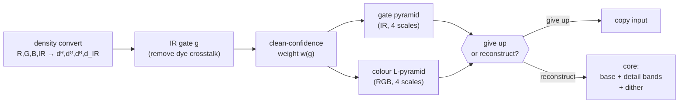
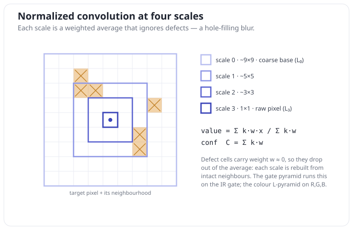

# The Digital ICE Algorithm

This document explains **what Digital ICE computes**, in enough detail to reimplement it from scratch, but
without reference to source code. It describes the target‑8 profile of a Nikon Coolscan LS‑5000; other
scanners differ only in the numeric profile constants (Appendix A).

The companion source in [`../src`](../src) is one concrete realization of exactly this algorithm; where a
constant is quoted below, its exact bit pattern lives in `IceSetup.cs`.

---

## 0. The premise: infrared sees dust, not the picture

A colour film image is formed by three dye layers (cyan, magenta, yellow). Those dyes are essentially
**transparent to near‑infrared light**. Dust, scratches, fingerprints and emulsion damage are **not** — they
block or scatter IR just as they block visible light.

So a scanner that captures a 4th, infrared channel alongside R, G, B gets, for free, a **map of the physical
defects** that is independent of the picture content. Wherever the IR channel is dark, light was lost to a
defect, and *the same amount of light was lost from R, G, B at that spot.* Digital ICE uses the IR channel to

1. locate defects,
2. estimate how much light each defect stole from the visible channels, and
3. rebuild the visible colour there from surrounding intact pixels, guided by the IR map.

Everything below is the machinery that does (1)–(3) robustly.

---

## 1. Working domain: logarithmic density

All processing happens in a **log‑density** domain, not on raw linear samples. Define, for a 16‑bit sample
$v \in [0, 65535]$ and $M = 65535$,

$$
D(v) \;=\; \frac{M}{16\ln 2}\,\ln(v+1) \;=\; \frac{M}{16}\,\log_2(v+1).
$$

This maps $[0,M] \to [0,M]$ monotonically, with $D(0)=0$ and $D(M)=M$ exactly. Working in density means the
dye‑absorption model is **linear**: a defect that removes a factor of the light becomes an additive offset in
density, so "add back the light lost to dust" becomes "add back a density offset" — the whole reconstruction is
built on differences and weighted sums of density values.

Every raw sample (R, G, B, IR) is converted through $D$ on the way in. The final output is converted back with
the inverse,

$$
D^{-1}(d) \;=\; \operatorname{round}\!\big(e^{\,d\,\cdot\,16\ln 2 / M} - 1\big), \qquad \text{clamped to } [0, M].
$$

Notation used throughout: $d_R, d_G, d_B, d_{IR}$ are the density‑converted channels of a pixel.

---

## 2. Calibration (once, from a low‑resolution prescan)

Before the real pass, ICE runs a quick analysis over a **low‑resolution scan of the same frame** (or, lacking
one, a down‑sampled copy of the main scan) to measure three numbers that describe *this frame's clear film*.
These are then held **constant** for the entire main pass.

Let a pixel be **clear‑film** if its raw IR value exceeds a fixed gate $\tau = 8847.23$ (i.e. IR is bright — no
defect). Over the prescan:

**Two reference levels** (IR²‑weighted means over *all* clear‑film pixels):

$$
R_\text{ref} \;=\; \frac{\sum IR^2\, d_R}{\sum IR^2}, \qquad\qquad
IR_\text{raw} \;=\; \frac{\sum IR^2\, d_{IR}}{\sum IR^2}.
$$

$R_\text{ref}$ is the average red density of clear film; $IR_\text{raw}$ is its average IR density. (Weighting by
$IR^2$ leans the average toward the clearest pixels.)

**The dye→IR crosstalk** $c$. Real dyes are not *perfectly* IR‑transparent — a little of the visible signal
bleeds into IR. To measure that bleed, ICE looks only at **8×8 tiles that are entirely clear film** (all 64
pixels above $\tau$), so any variation must be dye, not dust. In each such tile it splits the 8×8 into four 4×4
quadrants, and for each quadrant $q$ forms the deviation of its mean density from the tile mean, in both planes:
$\delta^R_q, \delta^{IR}_q$. The ratio $\delta^{IR}_q / \delta^R_q$ is a local estimate of the crosstalk slope.
Keeping only plausible slopes (ratio in $[-0.2, 0.2]$) and weighting each quadrant by $(\text{tile IR sum})^2$,

$$
c \;=\; \frac{\sum_q \big(\delta^{IR}_q/\delta^R_q\big)\, w_q}{\sum_q w_q},
\qquad
w_q \;=\; \big(\delta^R_q\big)^2\,\Big(\textstyle\sum_{\text{tile}} IR\Big)^2 \ \ [\text{only if the ratio is in range}].
$$

**The clear‑film IR reference**, crosstalk‑corrected:

$$
\boxed{\,IR_\text{ref} \;=\; \frac{IR_\text{raw} - c\,R_\text{ref}}{1 - c}\,}
$$

The main pass uses just two of these downstream: the crosstalk $c$ and the reference $IR_\text{ref}$.

> Note on precision: sums are accumulated in double precision but rounded to single precision at the points the
> reference implementation does (per‑tile crosstalk carriers, the quadrant means). This matters only if you
> want bit‑exactness with the original Nikon Scan; the algorithm is unchanged either way.

---

## 3. The main pass, at a glance

The main pass streams the image one row at a time, keeping a vertical window of a few rows around the current
one (a ~7‑row look‑ahead) so that the vertical neighbourhoods below are available. That streaming is an
implementation convenience — **mathematically, every step below is a fixed‑size windowed operation over the
image**, and you can equally well process the whole frame with 2‑D windows.

For each pixel the pipeline is:

The two pyramids are the heart of it: one built from the IR gate (a scalar confidence/edge map at several
scales), one built from the visible colour (the reconstruction stack). The IR pyramid decides **where** the
colour pyramid is allowed to keep fine detail.

---

## 4. The IR gate: isolating the defect signal

First remove the dye crosstalk measured in §2 from the IR density, so the remaining signal responds to
**defects only**, not to the picture:

$$
g \;=\; \frac{d_{IR} - c\,d_R}{1 - c} \;-\; 1.
$$

$g$ is high on clear film (IR passes) and drops wherever a defect blocks IR. It is the single scalar "how
intact is this pixel" signal that drives everything downstream. (At full resolution the **weight** in §5 is
computed from the **minimum of the gate over 3 horizontal neighbours**, so a one‑pixel‑wide defect still
suppresses the weight — a conservative dilation. The gate stored for the pyramids is not min‑filtered.)

---

## 5. The clean‑confidence weight

Turn the gate into a **weight** $w \in [w_\text{floor}, 1]$ — a soft confidence that the pixel is intact and may
be trusted as evidence when reconstructing its neighbours:

$$
w(g) \;=\; \operatorname{clamp}\!\Big(\,1 + \big(IR_\text{ref} + b - g\big)\,s,\ \ w_\text{floor},\ \ 1\Big).
$$

The slope $s<0$ and bias $b$ are derived from the density curve at two profile **anchors** $0.85$ and $0.98$:

$$
s = \frac{1}{D(\lfloor 0.85\,M\rfloor) - M}, \qquad b = D(\lfloor 0.98\,M\rfloor) - M, \qquad w_\text{floor}=0.02.
$$

Because $s<0$: on clear film ($g \approx IR_\text{ref}$) the weight saturates at $1$; as the gate falls below the
reference (a defect), $w$ ramps down linearly and bottoms out at the floor $0.02$. So **intact pixels carry full
weight, defect pixels carry almost none.** This weight is what makes every averaging step below a *normalized
convolution* that ignores defects.

---

## 6. Two normalized‑convolution pyramids

A **normalized convolution** is a weighted average that fills holes: given values $x_i$ and confidences $w_i$
over a window with fixed taps $k_i$,

$$
\text{value} = \frac{\sum_i k_i\,w_i\,x_i}{\sum_i k_i\,w_i}, \qquad \text{confidence} = \sum_i k_i\,w_i .
$$

Where a defect sits, its $w_i \approx 0$, so it contributes nothing and the result is reconstructed from the
intact neighbours. The denominator is the local **confidence mass**; where it is small, the whole window is
defective and the estimate is untrustworthy.

ICE evaluates this at **four spatial scales**, using nested separable windows. The vertical part accumulates
running sums over $3, 5, 7, 9$ rows (centred); the horizontal part applies matching $3/5/7/9$‑tap kernels, so
the four scales are roughly $9\times9$ (coarsest), $5\times5$, $3\times3$, and $1\times1$ (the pixel itself).
Call the scales $\ell = 0,1,2,3$ from coarse to fine.

**The gate pyramid** $P_\ell$ and **confidence** $C_\ell$ apply the normalized convolution to the scalar gate
$g$ with weights $w$. Where the confidence mass is (near) zero, the pyramid value is set to $IR_\text{ref}$
(the clear‑film default). $P_\ell$ is thus a multi‑scale, defect‑filled version of the IR structure, and $C_\ell$
tells you how much intact evidence supported each scale.

**The colour L‑pyramid** $L_\ell$ applies the *same* normalized convolution to each visible channel, using the
weighted products $w\,d_{\{R,G,B\}}$ vertically summed and horizontally smoothed, normalized by the confidence:

$$
L_\ell \;=\; \frac{\sum k\,w\,d}{\sum k\,w}\quad (\ell = 0,1,2),\qquad L_3 = d_{\{R,G,B\}}\ \text{(the raw pixel density).}
$$

So $L_3$ is the original colour, $L_2, L_1, L_0$ are increasingly blurred **and defect‑filled** versions of it.
$L_0$ is essentially "what the colour would be here with all fine structure — including dust — smoothed away."

---

## 7. The per‑pixel decision: give up, or reconstruct

Not every pixel is reconstructed. A pixel is **given up** (its input copied through unchanged) when either:

- **It is already clean.** If the finest‑scale IR confidence at the pixel is at or above $1$, there is no defect
  to fix — leave it.
- **It is hopeless.** ICE probes four 9‑sample windows of the confidence signal (two at horizontal offsets
  $\pm 4$, two along the gate history). If *all nine* samples of any probe lie below the **dust floor**
  $\varphi = D(\lfloor 0.065\,M\rfloor)$, the pixel is buried too deep in a defect to reconstruct from its
  neighbours — leave it as scanned.

Everything else — some defect present, but enough intact evidence nearby — is **reconstructed** by the core
(§8). Give‑up is a *pure copy*: no dither, no change (this is why perfectly clean regions come through the
original bit‑for‑bit).

---

## 8. The reconstruction core

For a reconstructed pixel, build each output channel's density from the pyramid. Work per channel $ch\in\{R,G,B\}$.

**(a) Base colour + IR‑guided brightness compensation.** Start from the coarse, defect‑free base $L_0$, then tilt
it by how far the local IR sits from the clear reference — the first‑order estimate of light lost to the defect:

$$
\text{acc}_{ch} \;=\; L_{0,ch} \;+\; \gamma_{ch}\,\big(IR_\text{ref} - P_0\big), \qquad \gamma_{ch}\approx 1.10 .
$$

$P_0$ is the coarse gate pyramid at the pixel; $(IR_\text{ref}-P_0)$ is the local IR deficit; $\gamma_{ch}$ is a
per‑channel profile gain. This is the step that actually **adds back the missing light**.

**(b) Detail bands with an IR‑gated soft threshold.** Add back image detail scale by scale, as the successive
differences of the colour pyramid (a Laplacian‑pyramid reconstruction):

$$
\text{detail}^{(k)}_{ch} \;=\; \big(L_{k+1,ch} - L_{k,ch}\big)\,g_k,\qquad k = 0,1,2,\quad (g_0,g_1,g_2)=(1.25,\,1.25,\,1.25).
$$

If every band were added in full, the telescoping sum $L_0 + (L_1{-}L_0) + (L_2{-}L_1) + (L_3{-}L_2)$ would just
return the original $L_3$. The point is that each band is **soft‑thresholded against the local IR contrast**
before being added, so detail that the IR map does *not* support (i.e. dust texture) is discarded while genuine
film edges pass.

For band $k$, let $[\beta_\text{lo}, \beta_\text{hi}]$ be the local min/max of the scale‑$k$ gate‑pyramid detail
$P_{k+1}-P_k$ over a small 5‑point cross (center, its left/right, and the rows above/below) — this is the local
IR contrast at that scale. With two per‑(channel, band) profile coefficients $a_\text{lo}, a_\text{hi}$ of order
one ($\approx 0.85\text{–}1.25$; exact values in Appendix A, swapped when the band is entirely negative), the
passed residual is a **dead‑zone / soft‑clip**:

$$
r =
\begin{cases}
\text{detail} - a_\text{lo}\,\beta_\text{lo}, & \text{detail} < a_\text{lo}\,\beta_\text{lo} \le a_\text{hi}\,\beta_\text{hi},\\[2pt]
0, & a_\text{lo}\,\beta_\text{lo} \le \text{detail} \le a_\text{hi}\,\beta_\text{hi},\\[2pt]
\text{detail} - a_\text{hi}\,\beta_\text{hi}, & \text{detail} > a_\text{hi}\,\beta_\text{hi},
\end{cases}
\qquad
\text{acc}_{ch} \mathrel{+}= r\cdot C_k .
$$

Detail within a band proportional to the local IR contrast is zeroed (dead zone); detail beyond it is passed
with the threshold subtracted (soft‑clip toward zero). Finally the contribution is weighted by that band's
confidence $C_k$ (from the mask), so bands with little intact evidence contribute little. Intuition: **fine
image structure is re‑injected only where matching IR structure vouches for it.** Dust — bright/dark specks with
no supporting IR edge, sitting on low‑confidence pixels — falls in the dead zone and is removed.

The confidence $C_k$ used here is derived from the mask: for band 0 the coarse confidence is doubled and clamped
to $\{0,1\}$; for band 2 it is squared; band 1 uses it directly (with a non‑negativity clamp) — profile details
that sharpen how aggressively each scale is trusted.

**(c) The "only fill, never darken" clamp.** Reconstruct only if all three channel accumulators came out
positive (a sanity guard; otherwise give up). Then each output is the **brighter, in density, of the raw pixel
and the reconstruction** (with dither, §9):

$$
\text{out}_{ch} \;=\; \max\!\big(\,L_{3,ch}\ ,\ \ \text{acc}_{ch} + \text{dither}_{ch}\big).
$$

Because a defect only ever *removes* light (lowers density), ICE only ever fills toward the reconstruction and
never pulls a pixel darker than it was scanned. Clean detail that survived (raw brighter than the fill) is kept
untouched.

---

## 9. Dither

Reconstructed regions would otherwise be visibly smoother than the surrounding film grain. ICE adds a
**zero‑mean grain** that vanishes at the extremes of the tonal range and peaks in the mid‑tones. For a channel
value $x$ with a per‑channel amplitude $\alpha_{ch}$ (small; see Appendix A):

$$
\text{dither} =
\underbrace{\frac{4}{(\eta_\text{hi}-\eta_\text{lo})^2}\,(x-\eta_\text{lo})(\eta_\text{hi}-x)}_{\text{parabolic envelope, }0\text{ at band edges}}
\;\cdot\; \underbrace{\big(u - \tfrac12\big)}_{\in[-\frac12,\frac12)} \;\cdot\; \alpha_{ch}\,x ,
$$

applied only when $x$ lies inside the density band $[\eta_\text{lo}, \eta_\text{hi}] = [D(\lfloor
0.01M\rfloor),\,D(\lfloor 0.99M\rfloor)]$ **and** $x+\text{dither}$ stays inside it (otherwise the grain is
zero). $u$ is a uniform pseudo‑random draw.

The randomness comes from a single **linear congruential generator** shared across the whole frame, advanced
once per draw and never reseeded from a fixed start:

$$
\text{state} \leftarrow (\text{state}\cdot 125 + 1) \bmod 2^{24}, \qquad u = (\text{state}+1)\cdot 2^{-24}.
$$

Because one LCG feeds every reconstructed pixel in raster order, the grain is deterministic but decorrelated
between pixels. (A from‑scratch reimplementation is free to substitute a real RNG here — the grain is
zero‑mean and its exact pattern is not visually meaningful. Matching the *original byte‑for‑byte* requires
this specific LCG and seed **and** reproducing the reconstruction in the original's 80‑bit x87 precision: the
number of LCG draws per pixel depends on the band‑membership and clamp tests above, so a reduced‑precision port
(e.g. IEEE `double`) eventually flips one of those tests, drifts out of LCG phase, and from there re‑grains
every reconstructed pixel — changing the noise realization, not the dust removal underneath.)

---

## 10. Output

Convert each reconstructed (or copied) density back to a linear 16‑bit sample with $D^{-1}$ (§1) and write R, G,
B. The IR channel is consumed and dropped. The result is a defect‑free linear RGB image.

---

## Appendix A — target‑8 profile constants

These are the LS‑5000 target‑8 values. A different scanner/film target replaces this whole block.

| Quantity | Symbol | Value |
|---|---|---|
| Density curve | $D(v)$ | $\dfrac{65535}{16\ln 2}\ln(v+1)$ |
| Clear‑film IR gate (raw) | $\tau$ | $8847.23$ |
| Crosstalk ratio window | — | $[-0.2,\ 0.2]$ |
| Weight anchors | — | slope $0.85$, bias $0.98$ |
| Weight floor | $w_\text{floor}$ | $0.02$ |
| Dust floor anchor | — | $0.065$ (floor $=D(\lfloor 0.065M\rfloor)$) |
| Detail band gains | $g_0,g_1,g_2$ | $1.25,\ 1.25,\ 1.25$ |
| Give‑up: samples below floor to abandon | — | all $9$ of any probe window |
| Give‑up: clean‑IR confidence threshold | — | $1.0$ |
| Dither band anchors | $\eta_\text{lo},\eta_\text{hi}$ | $0.01,\ 0.99$ |
| Dither envelope numerator | — | $4$ |
| Dither amplitudes (R,G,B) | $\alpha$ | $0.015,\ 0.015,\ 0.025$ |
| LCG | — | $x\!\leftarrow\!(125x+1)\bmod 2^{24}$, seed $0\text{x}3045$ |

**Per‑channel reconstruction coefficients** (7 per channel). Index $0$ is the IR‑reference gain $\gamma_{ch}$ of
§8(a); indices $(1,2)$, $(3,4)$, $(5,6)$ are the $(a_\text{hi}, a_\text{lo})$ soft‑threshold pair for detail
bands $0, 1, 2$ respectively.

| ch | $k{=}0$ | $1$ | $2$ | $3$ | $4$ | $5$ | $6$ |
|---|---|---|---|---|---|---|---|
| R | 1.100 | 1.210 | 1.090 | 1.170 | 1.080 | 1.040 | 0.960 |
| G | 1.100 | 1.230 | 1.130 | 1.140 | 1.050 | 0.930 | 0.840 |
| B | 1.100 | 1.130 | 1.040 | 1.080 | 1.020 | 0.970 | 0.890 |

Exact 32‑bit bit patterns for all of the above are in [`../src/IceSetup.cs`](../src/IceSetup.cs).

---

## Appendix B — the multi‑scale windows

The four pyramid scales come from nested, separable, odd‑tap kernels. Vertically, four cumulative sums are
maintained over the centred neighbourhoods of $3, 5, 7, 9$ rows; a fifth, centre‑weighted 3‑row sum (scaled by
$1/16$) feeds the finest colour scale. Horizontally, matching taps combine those column sums:

| scale $\ell$ | ~window | role |
|---|---|---|
| 0 | $9\times9$ | coarse defect‑filled base ($L_0$), coarse gate ($P_0$) |
| 1 | $5\times5$ | mid detail |
| 2 | $3\times3$ | fine detail |
| 3 | $1\times1$ | the raw pixel ($L_3$ = input density) |

The exact tap layouts (which column‑sum feeds which output tap) are given, with comments, in the front‑half
builders in [`../src/IceFront.cs`](../src/IceFront.cs) and the back‑half `VBuild`/`LBuild` in
[`../src/IceBack.cs`](../src/IceBack.cs). They are ordinary fixed‑coefficient separable convolutions; the
precise coefficients affect only the last bit of the result.

---

## Appendix C — symbols

| Symbol | Meaning |
|---|---|
| $M$ | $65535$, the max 16‑bit level / density index |
| $D(v),\ D^{-1}(d)$ | density transform and its inverse |
| $d_R,d_G,d_B,d_{IR}$ | density‑converted channels |
| $c$ | dye→IR crosstalk (calibration) |
| $R_\text{ref}, IR_\text{raw}$ | clear‑film red / IR density references (calibration) |
| $IR_\text{ref}$ | crosstalk‑corrected clear‑film IR reference |
| $g$ | the IR gate (defect signal) |
| $w$ | clean‑confidence weight in $[0.02,1]$ |
| $P_\ell,\ C_\ell$ | gate pyramid value / confidence mass at scale $\ell$ |
| $L_\ell$ | colour pyramid at scale $\ell$ ($L_3$ = raw) |
| $\beta_\text{lo},\beta_\text{hi}$ | local IR contrast bounding a detail band |
| $\gamma_{ch}, a_\text{lo}, a_\text{hi}$ | per‑channel reconstruction coefficients |
